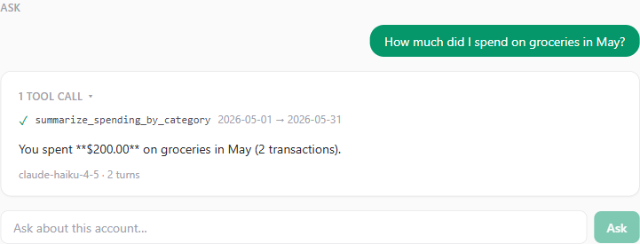
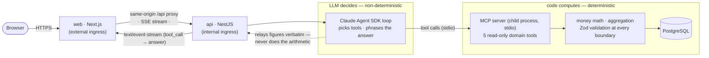

# LedgerLens

An **AI-native, agentic financial analyst**. Upload bank/credit statements; an agent
ingests, categorises, and answers natural-language questions about your finances — with
**deterministic money math** and a **rigorous evaluation harness** behind every LLM feature.

> Portfolio project. Personal IP, **synthetic data only**. Built TypeScript-first around
> the Claude **Agent SDK** and a custom **MCP server** as the core of the design, not a
> bolt-on. Developed end-to-end with Claude Code under a spec-/ADR-first workflow.

## Demo

The agent **shows its work**: it streams each MCP tool-call live, then answers — and the
figures come straight from the tools, never from the model's arithmetic.



More: [account picker](docs/assets/demo/ll-01-accounts.png) ·
[account + transactions](docs/assets/demo/ll-02-account.png) ·
[full chat view](docs/assets/demo/ll-03-chat.png).

**Live app:** deployed to Azure Container Apps, but **kept stopped between demos for
cost** (the Postgres Flexible Server stops when idle — a deliberate cost-discipline
choice). I start it on request for interviews. The walkthrough: pick a demo account →
see categorised transactions → ask a question → watch the agent call a tool and answer.

## Why it's built this way

The interesting engineering here is not "we called an LLM." It is **knowing when *not*
to**:

- **A determinism-first boundary** ([ADR-0004](docs/adr/0004-determinism-first-llm-boundary.md)).
  The model decides *what* to compute and phrases the result; **pure functions compute the
  money**. Wrong numbers are never acceptable in finance, so anything that can be
  deterministic must be — money math, aggregation, reconciliation, validation.
- **A custom MCP server** exposing typed, read-only domain tools the agent calls over
  stdio — the agent's only path to data, with account scoping enforced in code.
- **An eval harness** (Phase 5) that gates prompts, tool selection, and agent behaviour
  on a discriminating golden set — so every LLM feature is *measured*, not hoped for. It
  even caught a determinism violation in my own code (see [Evaluation](#evaluation)).

## Architecture



The **dashed line is the thesis**: the agent *relays* figures the deterministic tools
computed; it never does money math itself. One agent loop serves both `/ask` (JSON) and
`/ask/stream` (SSE) so the two transports can't drift. Topology and the cloud SSE gate:
[ADR-0011](docs/adr/0011-azure-container-apps-deployment-topology.md),
[ADR-0010](docs/adr/0010-streaming-agent-events-over-sse.md).

## Evaluation

Every LLM feature is gated by a harness over a **23-case discriminating golden set**
(single-figure → multi-tool composition → edge/partial date ranges → large odd-cents →
honesty refusals, across two currencies). Four metrics; **tool-selection + answer gate at
≥ 90%**, faithfulness + scope are reported. Fresh two-model run (`pnpm eval`):

| Model | Tool sel | Answer | Faithful | Scope | Cost (USD) | Turns | Gate |
|---|---|---|---|---|---|---|---|
| `claude-haiku-4-5` | 100% | 100% | 100% | 100% | 0.385 | 2.0 | ✅ PASS |
| `claude-sonnet-4-6` | 100% | 96% | 100% | 100% | 0.526 | 2.0 | ✅ PASS |

**Haiku is the cost-justified default** (~27% cheaper, both clear the gate) — *not*
proven-superior. The honesty is the point: on this single run Sonnet missed one
figure-extraction case (`usd-june-net`), which is exactly the **single-run / no-temperature
variance** the report is candid about — not a ranking. The harness also **caught a bug in
my own code**: the agent was doing the ÷100 decimal placement itself and mis-rendering
large magnitudes (worst on Haiku); the fix was architectural — the tools now emit a
deterministic decimal the agent only relays. Full write-up, methodology, and the second
eval-surfaced bug: **[docs/eval-report.md](docs/eval-report.md)**.

## Engineering rigor (the production-grade signals)

- **The eval caught my own determinism violation** (the ÷100 bug) — and the figure
  pass-rate recovered after the architectural fix, disproportionately for Haiku.
- **Fail-closed deploy**: the migrate/seed job *asserts* the DB connection is TLS
  (`pg_stat_ssl`) and that the seed is present, or the deploy exits non-zero.
- **An empirical SSE gate**: streaming is verified **un-buffered through two cloud Envoy
  hops** with per-frame timestamps (tool frames arrive before the answer), not assumed
  ([ADR-0011 §4](docs/adr/0011-azure-container-apps-deployment-topology.md)).
- **Observability without a new LLM surface**: OpenTelemetry → App Insights with an
  `agent.ask` span + per-tool child spans + cost/turns metrics, a strict no-op when its
  connection string is absent ([ADR-0013](docs/adr/0013-observability-opentelemetry-to-app-insights.md)).

## Stack

TypeScript (strict) · Next.js (App Router) · NestJS · PostgreSQL + Drizzle · Claude API ·
Claude **Agent SDK** · **MCP** · Zod · Vitest + testcontainers · Biome · Docker · **Azure
Container Apps** (Bicep IaC, managed-identity ACR pull, OpenTelemetry) · GitHub Actions.

## Getting started

Requirements: Node 22+, pnpm 9+, Docker.

```bash
pnpm install
cp .env.example .env            # add ANTHROPIC_API_KEY; PowerShell: copy .env.example .env
docker compose up -d postgres   # local DB (Adminer on :8080)
pnpm --filter @ledger-lens/db db:migrate && pnpm --filter @ledger-lens/db db:seed:demo
pnpm dev                        # web :3000 + api :3001

pnpm check                      # lint + typecheck + unit tests (no Docker)
pnpm test:integration           # integration tests (testcontainers; needs Docker)
pnpm eval                       # runs the real agent — spends tokens; needs ANTHROPIC_API_KEY + Docker
```

## Repo layout

```
apps/api            NestJS backbone + Agent SDK orchestrator + categorisation
apps/web            Next.js frontend (streaming agent chat, transactions, upload)
packages/shared     shared domain types & Zod schemas (Money, taxonomy)
packages/db         Drizzle schema, migrations, repository, demo seed
packages/mcp-server domain MCP server (read-only tools)
packages/evals      eval harness + golden datasets
docs/adr            architecture decision records   (index: docs/README.md)
docs/specs          feature specs (written before code)
infra               Bicep IaC, deploy.sh, RUNBOOK.md
```

Decision records and specs are indexed in **[docs/README.md](docs/README.md)**.

## Build phases

Built in reviewable increments; the git history is meant to read as a clear AI-native
workflow.

- **Phase 0–4 — done.** Monorepo + strict tooling + AI-native config; domain core (Money
  value object, CSV ingestion, Drizzle); LLM categorisation (forced tool-use + Zod);
  custom MCP server (5 read-only tools); agentic Q&A (Agent SDK + MCP-over-stdio,
  code-enforced account scoping).
- **Phase 5 — done.** Eval harness + golden datasets over an ephemeral Postgres
  (testcontainers); model locked to Haiku as the cost-justified default.
- **Phase 6 — done.** Next.js frontend: account picker, CSV upload, keyset transactions
  table, one-click categorisation, and a **streaming chat** that renders the agent's tool
  calls live over SSE. The UI computes no money.
- **Phase 7 — done.** Docker images + **Azure Container Apps** deploy (Bicep, migrate/seed
  Job, managed-identity ACR pull), the cloud SSE-through-Envoy gate, and **OpenTelemetry →
  App Insights** observability. Ops: [`infra/RUNBOOK.md`](infra/RUNBOOK.md).
- **Phase 8 — in progress.** Polish & presentation: this README, the eval report, demo
  assets, docs index.

## What's next

- **CI/CD via GitHub Actions + OIDC** (`deploy.yml`): workload-identity federation (no
  stored secret), build/push to ACR, `az deployment group create` over the Bicep — the
  scoped next step toward hands-off deploys.
- **Key Vault-backed secrets** (currently ACA secrets; the documented upgrade path).
- **The eval as a cloud CI gate**, PDF statement ingestion, and multi-account
  reconciliation.

## AI-native workflow

Developed with Claude Code under the conventions in [`CLAUDE.md`](CLAUDE.md): specs
precede code (`/new-feature-spec`), big decisions get an ADR (`/new-adr`), and generated
code is reviewed line-by-line before merge (`/review`). 13 ADRs + 7 specs record the
*why* — see the [docs index](docs/README.md).

## License

Licensed under the Apache License 2.0 — see [LICENSE](LICENSE) and [NOTICE](NOTICE).
